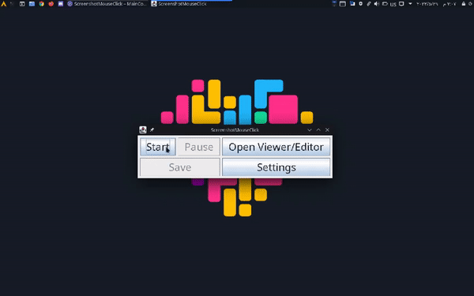
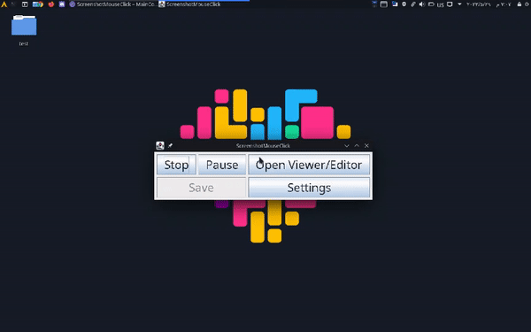
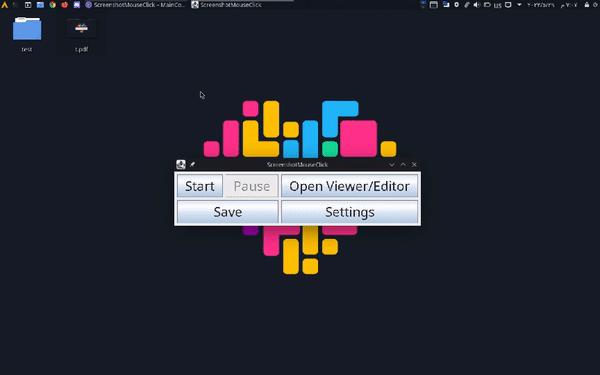

# ScreenshotMouseClick

A program to take a screenshot of steps to solve a problem and save it as a PDF or images 🤓
### NOTE: This is still a work in progress, not all features has been implemented

### CodeFactor

### WakaTime

# image

#  

#  

## Features

- You can Screenshot  the steps to solve a problem
- Save images either as a PDF or as images arranged in a folder
- GUI program is easy and understandable
- You can control taking pictures, whether you stop or restart it, and also save it to any place you want
- You can customize the shape of the mouse, the colors and the font size
- Will be constantly updated
## libraries
- jnativehook
- pdfbox
- miglayout

## Operating Systems supported
- Linux
- Windows
- MacOS
